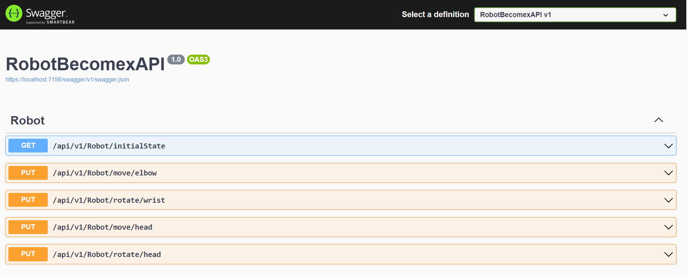
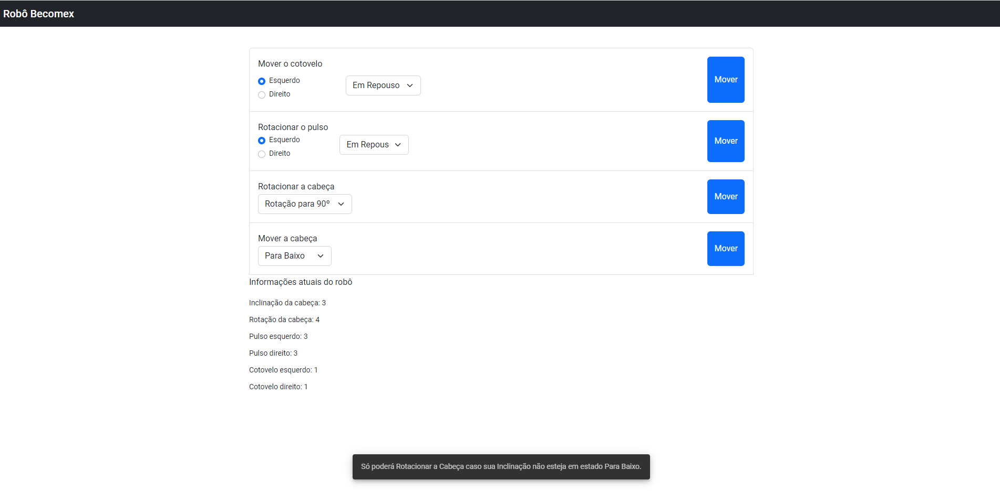

# Avaliação Becomex

1. [Tecnologias utilizadas](#tecnologias)
2. [Utilização](#utilizacao)

## Tecnologias utilizadas 

### 1. Backend

O backend foi projeto nas seguintes tecnologias:

- Web API do ASP.NET Core
- .NET 6.0
- Visual Studio
- NUnit

### 2. Frontend

Já o frontend foi feito em angular nas seguintes versões:

- Angular CLI: 14.2.8
- Node: 16.13.1
- NPM: 8.1.2
- Visual Studio Code

## Utilização 

### 1. Backend

O backend consiste de dois pacotes, sendo que o RobotBecomexAPI é onde se encontra os endpoints que controlam o robô e RobotBecomexAPITest é onde está localizado os testes unitários.

Para executar o backend basta executá-lo com o auxílio do Visual Studio. Assim que aplicação subir, será possível ver os endpoints na interface do swagger (https://localhost:7156/swagger/index.html).

### 2. Frontend

Já o frontend está localizado no diretório robotBecomex e após instalar as ferramentas necessárias, basta instalar as dependências utilizadas e subir o servidor do frontend pela linha de comando:
- **npm install**
- **npm start**

A aplicação subirá na url http://localhost:4200/, onde será possível ver uma simples interface que controlará o robô.

